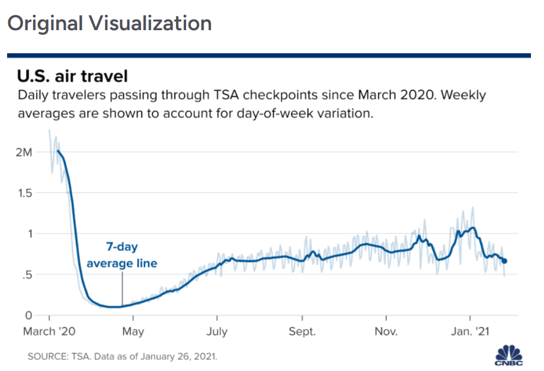
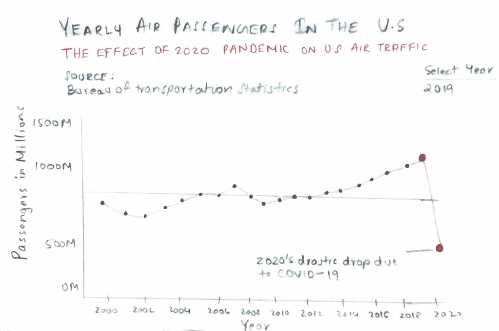

| [home page](https://aishwaryapramod99.github.io/Aishwarya_Portfolio/) | [visualizing debt](visualizing-government-debt) | [critique by design](critique-by-design) | [final project I](final-project-part-one) | [final project II](final-project-part-two) | [final project III](final-project-part-three) |

# "US Air Travel Falls Due to Covid Epidemic" Visualization
For this project I selected the "US Air Travel Falls Due to Covid Epidemic" visualization and the data source is Bureau of Transportation Statistics. This visualization shows the drastic decline in air travel during the Covid-19 pandemic. Here I am to critique the original visualization and build a more impactful one which gives a better representation than what it does. I have also documented the feedbacks and the final updated design.

## Step one: the visualization

_Include link to the original data visualization (or screenshot - make sure to correctly cite your sources, etc.).  Include paragraph or two on why you selected this particular data visualization.  For obvious reasons, the data visualization you select should come from a publicly accessible source._

For this project I selected the "US Air Travel Falls Due to Covid Epidemic" visualization and the data source is Bureau of Transportation Statistics. This visualization shows the drastic decline in air travel during the Covid-19 pandemic. Here I am to critique the original visualization and build a more impactful one which gives a better representation than what it does. I have also documented the feedbacks and the final updated design.

Title: US Air Travel Falls Due to Covid Epidemic
Link to original dataset: https://forms.gle/Mp85L1LSA2otXVjz8

## Step two: the critique
_Don't forget to complete the Google Form found on the assignment page.  You can summarize your thoughts here._

For the critique, I used Stephen Few's Data Visualization Effectiveness Profile to evaluate the strengths and weaknesses of the original visualization. I assessed the following aspects:

Title: US Air Travel Falls Due to Covid Epidemic
Link to original dataset: https://forms.gle/Mp85L1LSA2otXVjz8

1. Usefulness: The visualization represents air travel traffic in U.S and how the impact of COVID-19. It is seen that number of passengers travelling reduced from March 2020. It also has a 7-day average line which helps decrease the noise from variations.
Rank: 9/10  
Reasoning: This visualization is helpful for those interested in understanding the impact of COVID-19 on air travel.

2. Completeness
The visualization does not contain more explanations of important external factors like restrictions of travel that may have resulted in these patterns.
Rank: 6/10
Reasoning: The data shown is clear and easy to understand but adding annotations or some marks in the chart for major dates or events would definitely help improve better understanding for the readers.

3. Perceptibility
The graph is not cluttered and well-spaced making easy to read and understand with properly marked labels and timeframes.
Rank: 7/10
Reasoning: The graph is perceptible and line chart is appropriate for showing trends over time. But some readers may find it slightly difficult to identify the differences between daily variations and the average line without having a closer look.

4. Truthfulness
The graph correct demonstrates what it claims that is daily travelers passing through TSA checkpoints. The data is trust-worthy without having any incorrect or inaccurate information.
Rank: 10/10
Reasoning: The data is represented accurately and it uses a trustable source (TSA) and does not misrepresent the data or make incorrect comparisons.

5. Intuitiveness
The chart is intuitive and has time series data. The labeling add in more clarity, but the lack of context could make it harder for unfamiliar audiences.
Rank: 8/10
Reasoning: While the graph is  easy to understand, some target groups may not be familiar with the concept of TSA checkpoints or the 7-day average and more information can be given on that for better understanding.

6. Aesthetics
The graph is clean and not cluttered. It is looks professional yet plain, so can be made more visually appealing in terms of design.
Rank: 6/10
Reasoning: The design is functional but lacks strong visual appeal. A more visually engaging color palette or additional design elements could make it more impactful.

7. Engagement
The chart highlights the key impact of air travel due to COVID-19 which might prompt discussions on related topics like how to recover from this economic situation and the future of the airlines industry.
Rank: 8/10
Reasoning: The sharp drop in numbers of passengers mainly during the initial months of the pandemic motivates the target audience to dive in further and consider the broader implications of the data.

Overall Observations:

The graph effectively communicates the impact of COVID-19 on U.S. air travel, especially with the sharp decline in March 2020. The inclusion of the 7-day average line helps in understanding the overall trend. However, it could benefit from a few improvements:

The visualization highlights the sudden decline during the months when COVID-19 occurred making it very impactful to the readers of this chart. Including the 7-day average assists in understanding the overall trend, however it there are few improvements to make it better:

    Adding annotations to highlight key events (e.g., travel bans).
    Enhancing the visual design to be more engaging.

Audience: 
The general audience is more interested in how COVID-19 has affected travel. This can be public health officials, airline industry or general people of the media. This is the most effective visualization for this audience, though it may need more details for those who are unfamiliar with TSA checkpoint data.

Closing:
This feedback is helpful as a review of how the visualization was presented but it does not say much about what really can make things effective like adding contextual annotations to the graph. I suggest:
Shifting from daily data to yearly data, making the chart easier to interpret over a long time-period.
Adding context like key event markers, government advisories, holiday spikes.
Simple yet impressive colors to make it more appealing and accessible to colorblind users.
Facilitate colours more to make the graph sensitive to the major points of highlighting, like the difference between 2020 and other years, which will empower it to retain the viewers' attention.
Add historical context to this graph by adding data from 2000-2020 which shows viewers the magnitude of how big this change has been.

## Step three: Sketch a solution

## Step four: Test the solution

_Before you conduct your interviews, prepare a simple script.  Use this as a guide and as a way to take notes as you go forward. Come up with your own list of questions you want to ask for the selected visualization. Keep the questions broad so you can get the most value out of your feedback. Then, document answers to your questions here._

Questions to ask (modify these for your own interviews): 

- Can you tell me what you think this is?

- Can you describe to me what this is telling you?

- Is there anything you find surprising or confusing?

- Who do you think is the intended audience for this?

- Is there anything you would change or do differently?

Results: 

_Don't identify or share personally identifiable information (PII) about the people you spoke to._

| Question                                               | Interview 1                                                          | Interview 2                                                          |
|--------------------------------------------------------|----------------------------------------------------------------------|----------------------------------------------------------------------|
| Can you tell me what you think this is?                | Looks like a graph of decline in the U.S. air travel due to pandemic. | Line chart of air travel in the United States over time.              |
| Can you describe to me what this is telling you?       | It's showing that because of COVID-19, air travel dropped significantly in 2020. | This graph shows air travel fell sharply during 2020 probably due to restrictions. |
| Is there anything you find surprising or confusing?    | Daily data looks noisy and I'm not sure if the 7-day average is helpful. | I feel like more detail on why it dropped certain months might be helpful. |
| Who do you think is the intended audience for this?    | Frequent travelers who want to know about the effect of COVID-19 on future travel trips. | This looks to be for economists or the airline industry.              |
| Is there anything you would change or do differently?  | I would like to see yearly or monthly data rather than daily data to get a high-level view. | It would be great to add some kind of filter to see comparisons.       |

Synthesis: 

_What patterns in the feedback emerge?  What did you learn from the feedback?  Based on this feedback, come up with what design changes you think might make the most sense in your final redesign._

Key patterns that emerged from these interviews include the visualization being understood to represent a decline in U.S. air travel because of the COVID-19 pandemic-with some confusion about the granularity of data. For example, one participant questioned if value was being provided by using daily points and showing it as a 7-day average. Otherwise, both interviewees were correctly able to perceive the dramatic decline in air travelling in the year 2020-one of them even tried to attribute this to travel restrictions. Second, one of the participants did request more information on what specific month or event brought such drops-so perhaps there is a better need for contextual markers.

These comments confirm that the original visualization did a good job conveying the overall trend in the sharp decline of air travel due to the pandemic. Both interviewees here felt the daily data points added noise for those viewers wanting to focus on the bigger picture. Both interviewees mentioned that it would be more intuitive and easily understandable if the data aggregation of the visualization was done on the month or yearly intervals. A great number of comments expressed a desire to have more information for example, annotating why the decline occurred, and when. Key events should be marked-namely. The line of the 7-day average hardly contributed anything to most viewers as interest was in time-period patterns, not short-term changes.

Moving to yearly or monthly will reduce noise and make it easier to read the overall trend. Adding appropriate annotation for key events like travel bans and lockdowns that will provide information. Coloring the data point for 2020 differently or use a larger marker to show its sharp decline will make it faster to understamd. I will also enhance the color scheme to make the chart more readable and accessible. Finally, I will eliminate the line plotting the 7-day average in order to better focus more on broader trends and provide a cleaner, more impressive visualization.

## Step five: build the solution

_Include and describe your final solution here. It's also a good idea to summarize your thoughts on the process overall. When you're done with the assignment, this page should all the items mentioned in the assignment page on Canvas(a link or screenshot of the original data visualization, documentation explaining your process, a summary of your wireframes and user feedback, your final, redesigned data visualization, etc.)._

<noscript></noscript><object class='tableauViz'  style='display:none;'><param name='host_url' value='https%3A%2F%2Fpublic.tableau.com%2F' /> <param name='embed_code_version' value='3' /> <param name='site_root' value='' /><param name='name' value='USAirTravelFallsDuetoCovidEpidemic_17266513904240&#47;Sheet2' /><param name='tabs' value='no' /><param name='toolbar' value='yes' /><param name='static_image' value='https:&#47;&#47;public.tableau.com&#47;static&#47;images&#47;US&#47;USAirTravelFallsDuetoCovidEpidemic_17266513904240&#47;Sheet2&#47;1.png' /> <param name='animate_transition' value='yes' /><param name='display_static_image' value='yes' /><param name='display_spinner' value='yes' /><param name='display_overlay' value='yes' /><param name='display_count' value='yes' /><param name='language' value='en-US' /><param name='filter' value='publish=yes' /></object>
 

